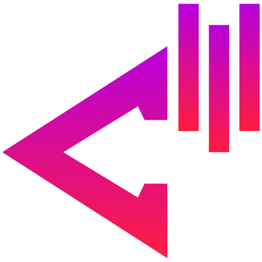
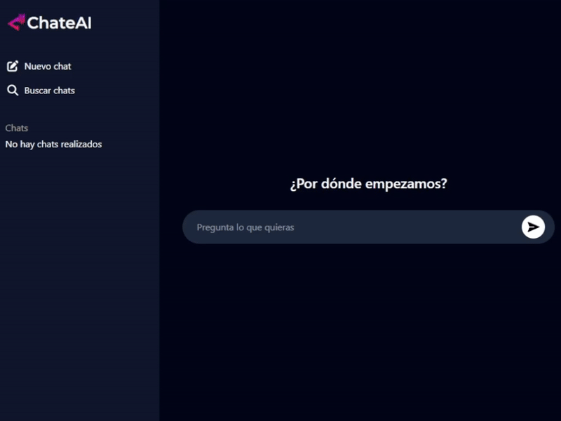

<h1 align="center">ChateAI</h1>

<div align="center">
  

  <p>Multiplatform desktop interface for visualizing, managing and interacting with LLMs.</p>

  
</div>

# Installation

## Build from Source

```bash
cd /chateai/frontend/
pnpm install
cd ..
go mod tidy
# for windows machines
wails build --platform windows/amd64 -o chateai_win_amd64.exe
# for linux machines
wails build --platform linux/amd64 -o chateai_linux_amd64 -tags webkit2_41
# for macos machines
wails build --platform darwin/universal -o chateai_mac_universal.app
```

# Requirements

- [Git](https://git-scm.com/) installed and accessible in your terminal
- [Go 1.25+](https://go.dev/dl/)
- [Wails](https://wails.io/docs/gettingstarted/installation) installed and accesible in your terminal
- [Node.js](https://nodejs.org/en/download/)
- [PNPM](https://pnpm.io/installation) recommended

Note:
- [SolidJS](https://docs.solidjs.com/), [TailwindCSS](https://tailwindcss.com/) and [Kobalte](https://kobalte.dev/docs/core/overview/introduction/) are used for frontend interfaces.
- [Garble](https://github.com/burrowers/garble) needed to generate obfuscated builds for Wails.

# Feature Support

| Feature | Status | Description |
|---------|--------|-------------|
| Storage | 🟢 | Store conversations in local database |
| Search | 🟢 | Find messages in conversations history |
| LLMs Finetuning | 🟢 | Finetune LLMs messages (temperature, repetition, etc.) |
| Markdown support | 🟡 | Markdown formatting for LLMs messages |
| Custom options | 🔴 | Customizable app options |

🟢 Supported &nbsp;&nbsp; 🟡 In Development &nbsp;&nbsp; 🔴 Planned

# Contributing

We welcome contributions! Please see our [Contributing Guidelines](CONTRIBUTING.md) for details on how to get started.

# License

This project is licensed under the MIT License - see the [LICENSE](LICENSE) file for details.

# Author

Felipe Gutiérrez Carilao

GitHub: @rainingdaemons
